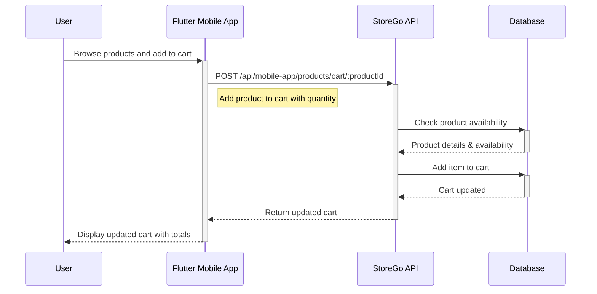
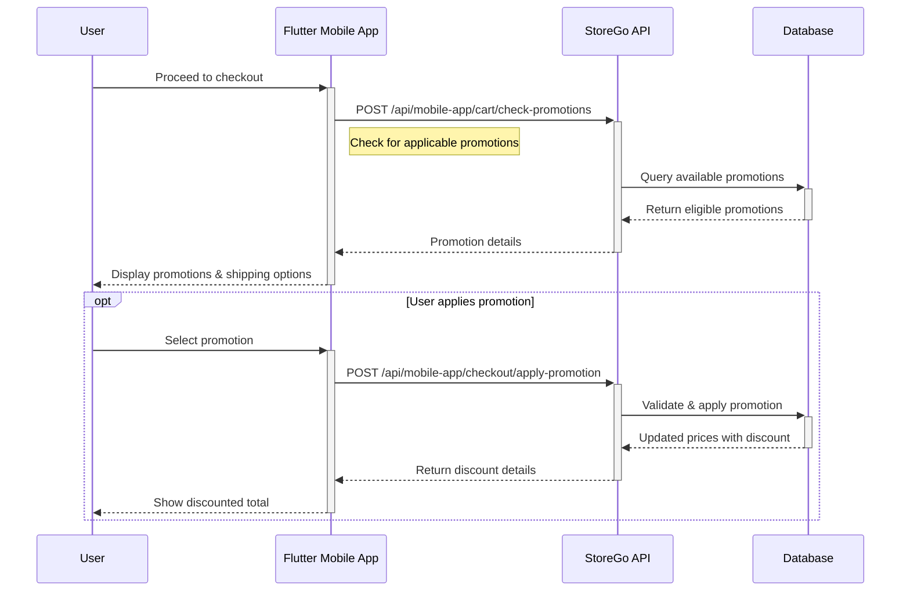
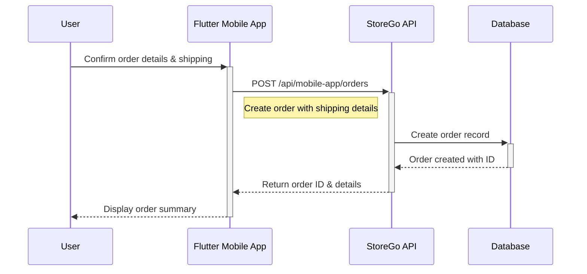
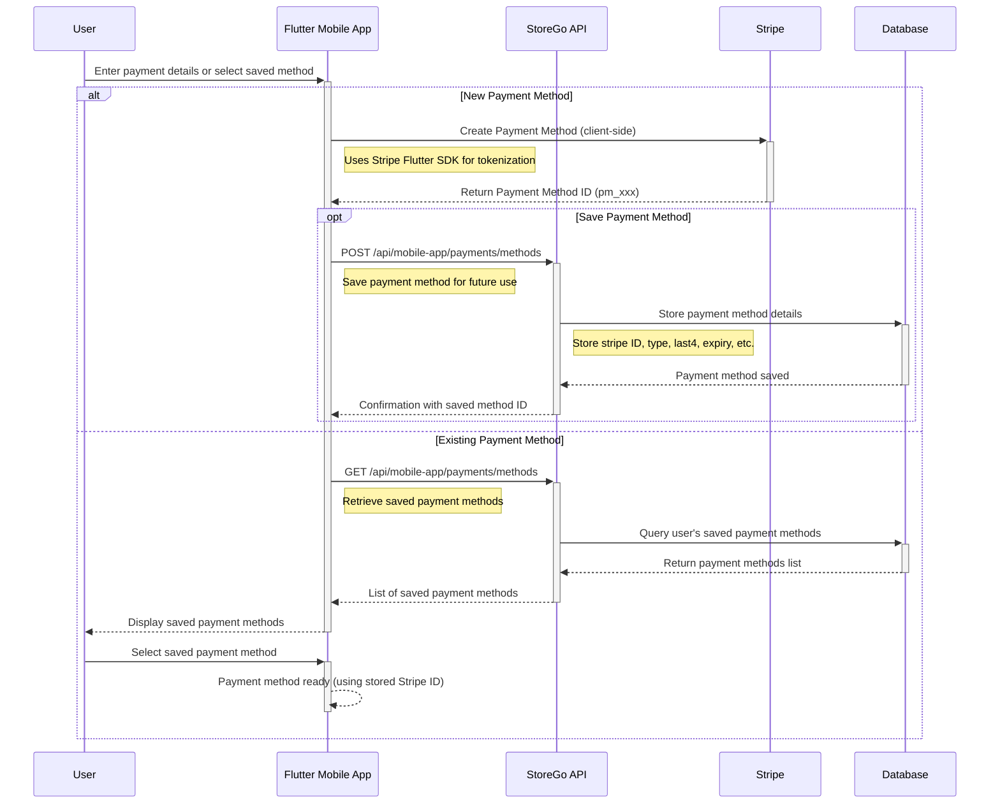
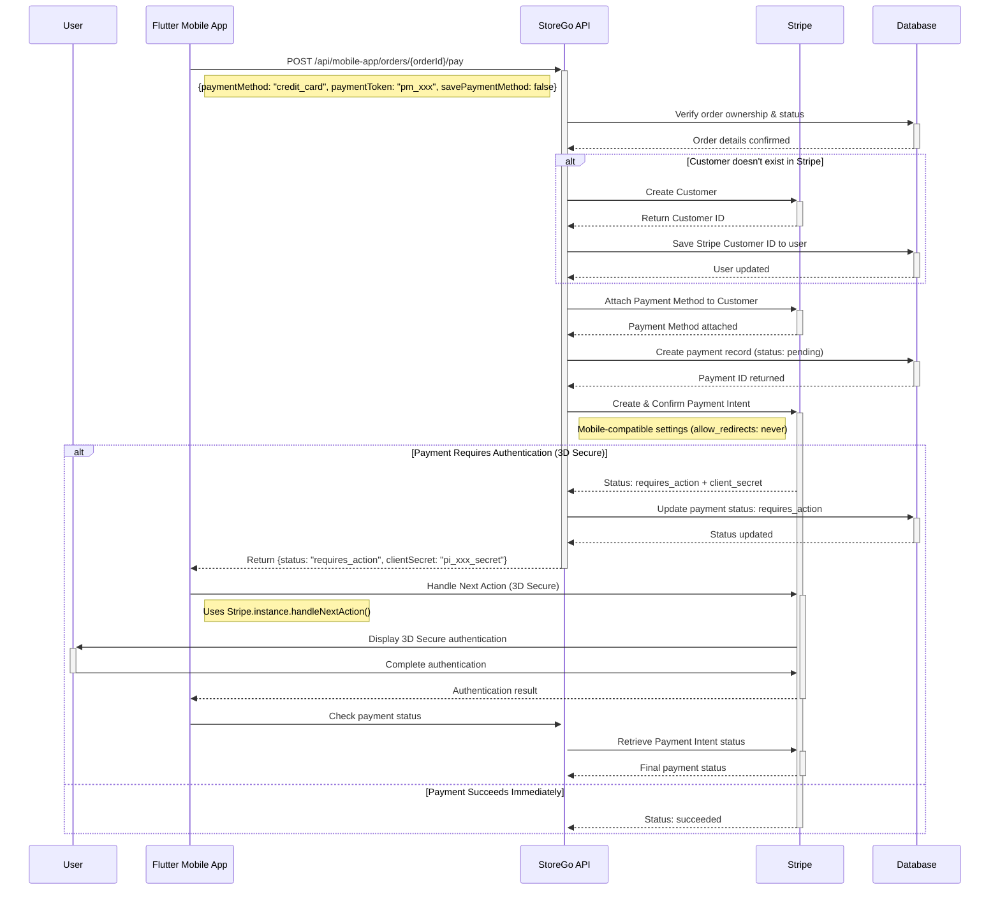
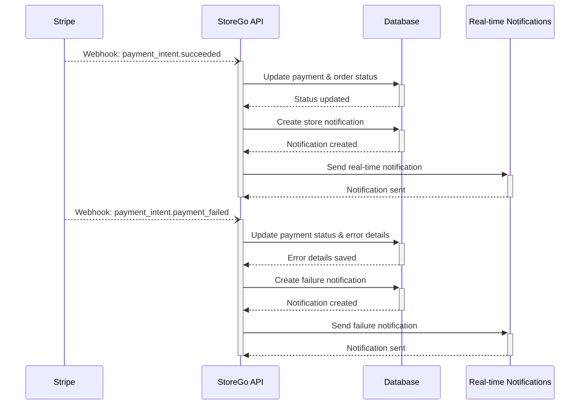
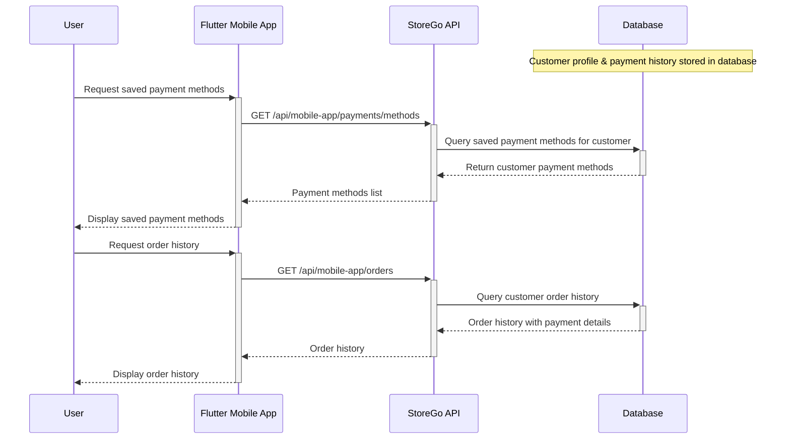

# StoreGo Payment Workflow Sequence Diagrams

This document contains detailed sequence diagrams showing the complete payment flow in the StoreGo system, broken down into focused sections with activity bars for better clarity.

## 1. Cart Setup & Product Selection



## 2. Checkout Process & Promotions



## 3. Order Creation



## 4. Payment Method Setup



## 5. Core Payment Processing



## 6. Payment Completion & Order Fulfillment

```mermaid
---
id: fecdfc7c-ffbf-4aba-b710-7f0a1b7ea751
---
sequenceDiagram
    participant User
    participant FlutterApp as Flutter Mobile App
    participant StoreGoAPI as StoreGo API
    participant Database

    alt Payment Successful
        StoreGoAPI->>+Database: Update payment status: paid
        Database-->>-Database: Payment record updated

        StoreGoAPI->>+Database: Update order payment_status: paid
        Database-->>-Database: Order status updated

        StoreGoAPI->>+Database: Clear cart items
        Database-->>-StoreGoAPI: Cart cleared, all updates confirmed

        StoreGoAPI-->>-FlutterApp: Return {status: "success", paymentId, orderId, amount}
        FlutterApp-->>-User: Display order confirmation

    else Payment Failed
        StoreGoAPI->>+Database: Update payment status: failed
        Database-->>-StoreGoAPI: Status updated
        StoreGoAPI-->>-FlutterApp: Return {status: "error", message}
        FlutterApp-->>-User: Display payment failure message
    end
```

## 7. Webhook Processing (Asynchronous)



## 8. Customer Data Management



## 9. Complete Payment Flow Overview

```mermaid
sequenceDiagram
    participant User
    participant FlutterApp as Flutter Mobile App
    participant StoreGoAPI as StoreGo API
    participant Stripe
    participant Database

    %% Phase 1: Cart & Checkout
    rect rgb(230, 245, 255)
        Note over User, Database: Phase 1: Cart Setup & Checkout
        User->>+FlutterApp: Add products to cart
        FlutterApp->>+StoreGoAPI: Cart operations
        StoreGoAPI->>+Database: Store cart data
        Database-->>-StoreGoAPI: Cart updated
        StoreGoAPI-->>-FlutterApp: Cart response
        FlutterApp-->>-User: Display cart

        User->>+FlutterApp: Proceed to checkout
        FlutterApp->>+StoreGoAPI: Create order
        StoreGoAPI->>+Database: Order creation
        Database-->>-StoreGoAPI: Order ID
        StoreGoAPI-->>-FlutterApp: Order details
        FlutterApp-->>-User: Order summary
    end

    %% Phase 2: Payment Setup
    rect rgb(255, 245, 230)
        Note over User, Stripe: Phase 2: Payment Method Setup
        User->>+FlutterApp: Enter payment details
        FlutterApp->>+Stripe: Create payment method
        Stripe-->>-FlutterApp: Payment method ID
        FlutterApp-->>-User: Payment method ready
    end

    %% Phase 3: Payment Processing
    rect rgb(245, 255, 230)
        Note over FlutterApp, Database: Phase 3: Payment Processing
        FlutterApp->>+StoreGoAPI: Process payment
        StoreGoAPI->>+Database: Validate order
        Database-->>-StoreGoAPI: Order validated

        StoreGoAPI->>+Stripe: Create customer & payment intent
        Stripe-->>-StoreGoAPI: Payment result

        StoreGoAPI->>+Database: Update payment status
        Database-->>-StoreGoAPI: Status updated
        StoreGoAPI-->>-FlutterApp: Payment response
    end

    %% Phase 4: Authentication (if needed)
    rect rgb(255, 230, 245)
        Note over User, Stripe: Phase 4: 3D Secure (if required)
        opt 3D Secure Required
            FlutterApp->>+Stripe: Handle authentication
            Stripe->>+User: 3D Secure challenge
            User->>-Stripe: Complete authentication
            Stripe-->>-FlutterApp: Auth result
        end
    end

    %% Phase 5: Completion
    rect rgb(240, 255, 240)
        Note over FlutterApp, Database: Phase 5: Payment Completion
        FlutterApp->>+StoreGoAPI: Confirm payment
        StoreGoAPI->>+Database: Finalize order
        Database-->>-StoreGoAPI: Order completed
        StoreGoAPI-->>-FlutterApp: Success response
        FlutterApp-->>-User: Order confirmation
    end

    %% Phase 6: Background Processing
    rect rgb(245, 245, 255)
        Note over Stripe, Database: Phase 6: Webhook Processing
        Stripe--)StoreGoAPI: Webhook events
        activate StoreGoAPI
        StoreGoAPI->>Database: Update records
        StoreGoAPI->>StoreGoAPI: Send notifications
        deactivate StoreGoAPI
    end
```

## Enhanced Component Analysis

### Activity Bar Notation Guide

- **`User->>+FlutterApp`**: User initiates action, Flutter app becomes active
- **`StoreGoAPI->>+Database`**: API starts database operation, database becomes active
- **`Database-->>-StoreGoAPI`**: Database completes operation and returns control
- **`FlutterApp-->>-User`**: Flutter app completes and shows result to user

### Detailed Component Responsibilities

#### User Entity

- **Role**: End consumer of the mobile application
- **Interactions**:
  - Product browsing and cart management
  - Checkout initiation and payment method selection
  - 3D Secure authentication completion
  - Order confirmation and status tracking
- **Security**: Biometric authentication, secure credential entry

#### Customer Entity (Business Logic)

- **Role**: Business account that owns orders and payment methods
- **Data Management**:
  - Payment method storage and reuse
  - Order history and analytics
  - Stripe customer relationship
  - Multi-store purchase tracking
- **Lifecycle**: Created on first order, persisted across sessions

#### Flutter Mobile App

- **Payment Security**:
  - PCI DSS compliance through Stripe SDK
  - No raw card data storage or transmission
  - Secure token-based payment processing
- **State Management**:
  - Cart state persistence
  - Payment flow progress tracking
  - Error recovery and retry mechanisms
- **User Experience**:
  - Loading indicators during API calls
  - Real-time payment status updates
  - Offline capability with sync on reconnection

#### StoreGo API

- **Authentication & Authorization**:
  - JWT token validation on every request
  - Multi-tenant store isolation
  - Order ownership verification
- **Payment Processing**:
  - Stripe Customer creation and management
  - Payment Intent creation with mobile optimizations
  - 3D Secure handling with client-secret flow
- **Data Integrity**:
  - Transaction atomicity for order creation
  - Payment status consistency across systems
  - Idempotency key handling for duplicate prevention

#### Stripe Platform

- **Payment Processing**:
  - Real-time authorization and capture
  - Risk assessment and fraud detection
  - 3D Secure authentication when required
- **Customer Management**:
  - Secure payment method storage
  - Customer payment history
  - Subscription and recurring payment support
- **Compliance**:
  - PCI DSS Level 1 certification
  - Global payment method support
  - Regulatory compliance (SCA, etc.)

#### Database Layer

- **Data Models**:
  - Orders: Comprehensive order lifecycle tracking
  - Payments: Detailed payment records with Stripe integration
  - Customers: Profile and preference management
  - Cart: Session-based shopping cart persistence
- **Performance**:
  - Optimized queries for payment operations
  - Indexing for fast order and payment lookups
  - Connection pooling for high availability
- **Backup & Recovery**:
  - Real-time data replication
  - Point-in-time recovery capabilities
  - Automated backup verification

### Integration Patterns

#### Synchronous vs Asynchronous Processing

- **Synchronous**: Order creation, payment authorization, immediate status updates
- **Asynchronous**: Webhook processing, notification delivery, analytics updates
- **Hybrid**: 3D Secure flows that start synchronous and complete asynchronously

#### Error Handling Strategies

- **Client-Side**: Network retry logic, graceful degradation, offline queuing
- **Server-Side**: Comprehensive error logging, automatic retry mechanisms, circuit breakers
- **Stripe Integration**: Webhook replay, payment status reconciliation, idempotency protection

#### Security Layers

1. **Transport Security**: HTTPS/TLS encryption for all communications
2. **Authentication**: JWT tokens with expiration and refresh mechanisms
3. **Authorization**: Role-based access control with store-level isolation
4. **Data Protection**: Payment tokenization, no PCI data storage
5. **Monitoring**: Real-time fraud detection, anomaly monitoring

This sequence diagram represents the actual implementation based on the codebase analysis, showing all the critical interactions between the specified components in the StoreGo payment workflow.
