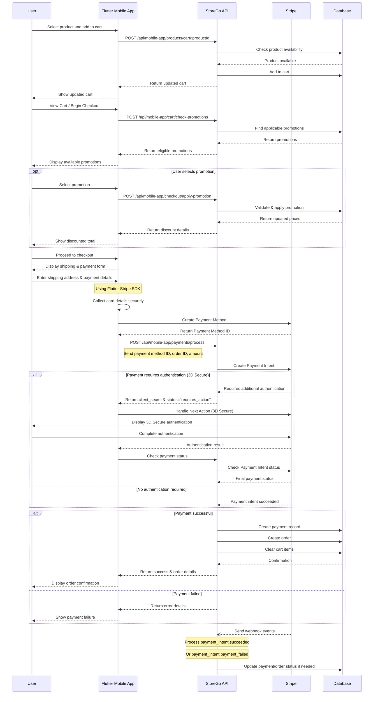

# Payment Workflow Sequence Diagram

This diagram illustrates the complete payment flow in the StoreGo mobile app, from adding an item to cart through checkout and payment processing with Stripe.

## Key Components in the Payment Flow

### Client-Side (Flutter Mobile App)

- Securely collects payment information using Flutter Stripe SDK
- Creates payment method token without sending card details to server
- Handles 3D Secure authentication when required
- Displays appropriate success or error messages to user

### Server-Side (StoreGo API)

- Validates request data including order details and payment information
- Creates payment intent with Stripe using customer's payment method
- Processes the payment and handles success/failure scenarios
- Records payment in database and updates order status
- Implements webhook handlers for asynchronous payment events

### Stripe

- Processes the payment securely
- Handles card authentication (3D Secure) when required
- Sends webhook events for payment status updates
- Provides tools for refunds and payment management

### Database

- Stores cart items, orders, and payment records
- Tracks payment status and order fulfillment
- Associates payments with orders and customers

## Error Handling

The sequence diagram includes error handling for payment failures. Additional error scenarios not shown in the diagram include:

1. **Card declined**: Stripe returns specific error code and message
2. **Network failures**: App implements retry mechanism
3. **Expired payment sessions**: System detects and requests new payment method
4. **Server-side validation failures**: API returns appropriate error codes

## Security Considerations

- JWT authentication for all API calls
- Tokenized payment methods (card details never touch StoreGo servers)
- HTTPS for all communications
- Idempotency keys to prevent duplicate charges
- Webhook signature verification
