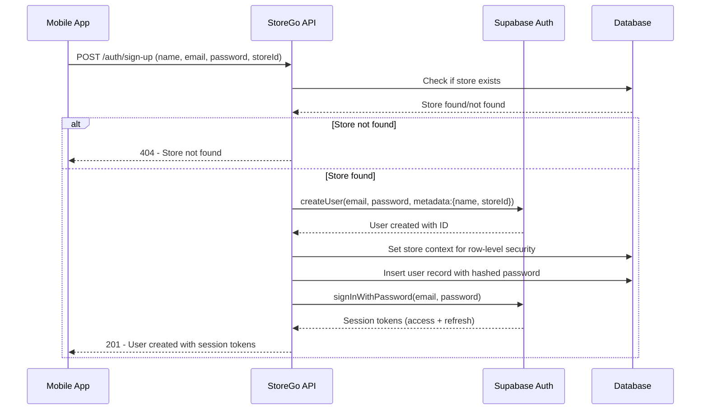
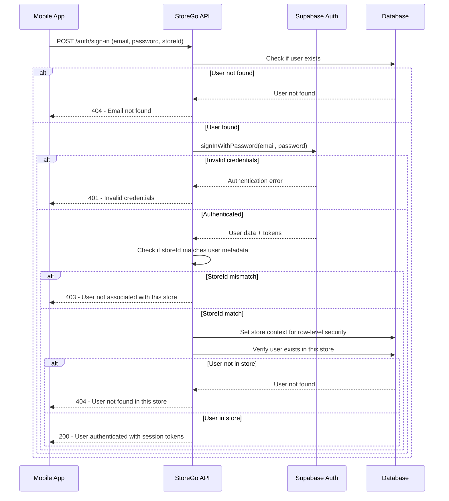
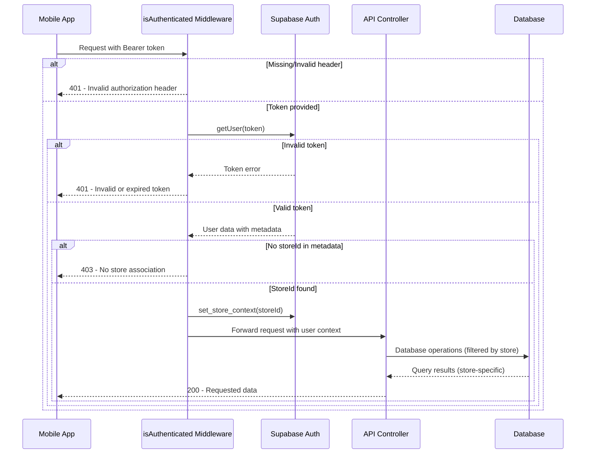
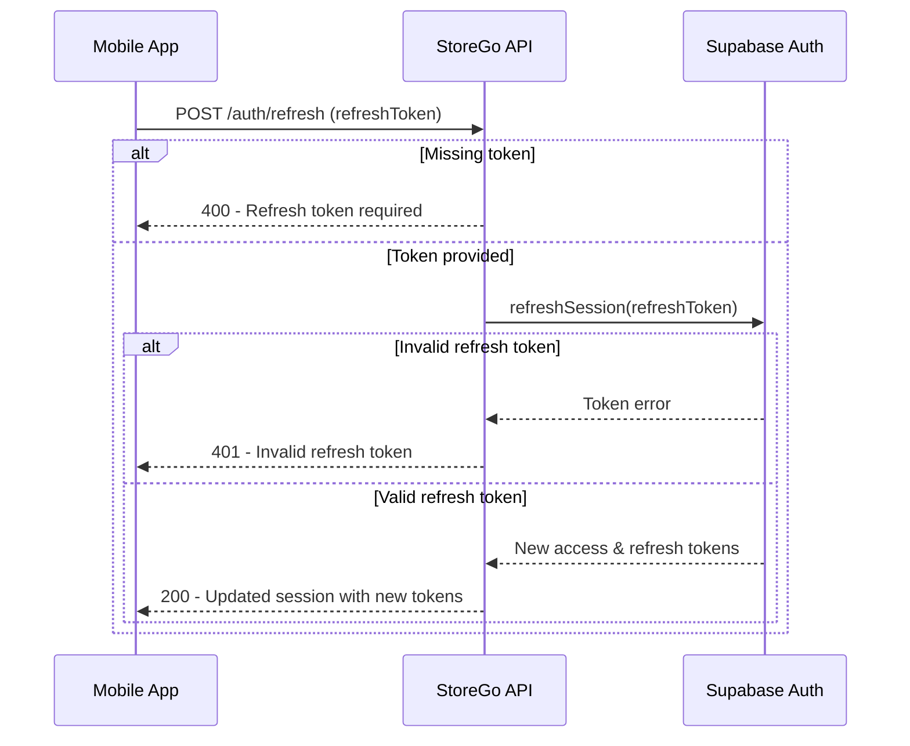
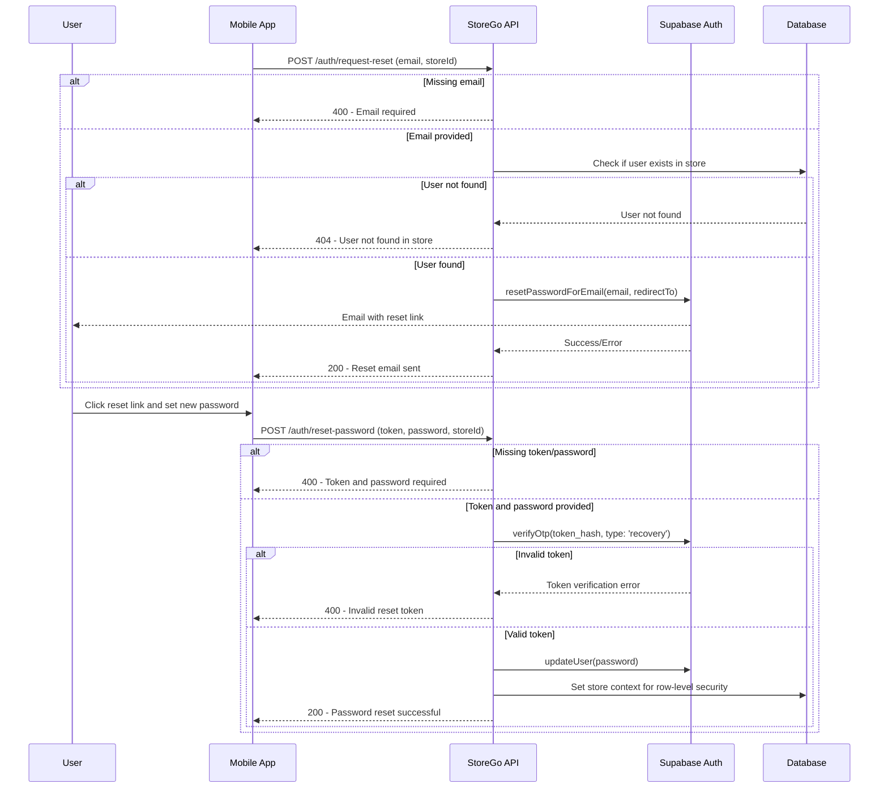
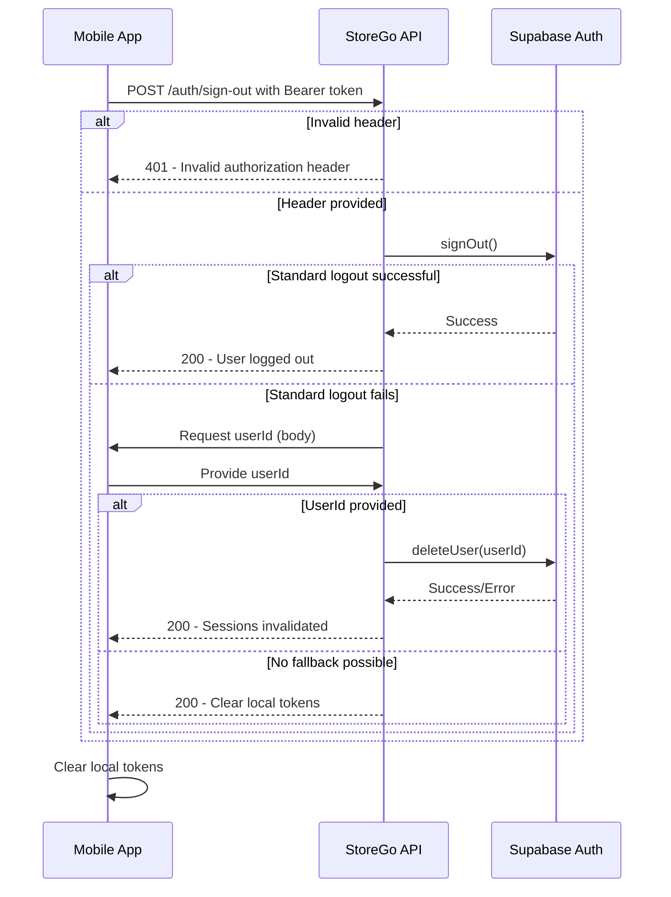
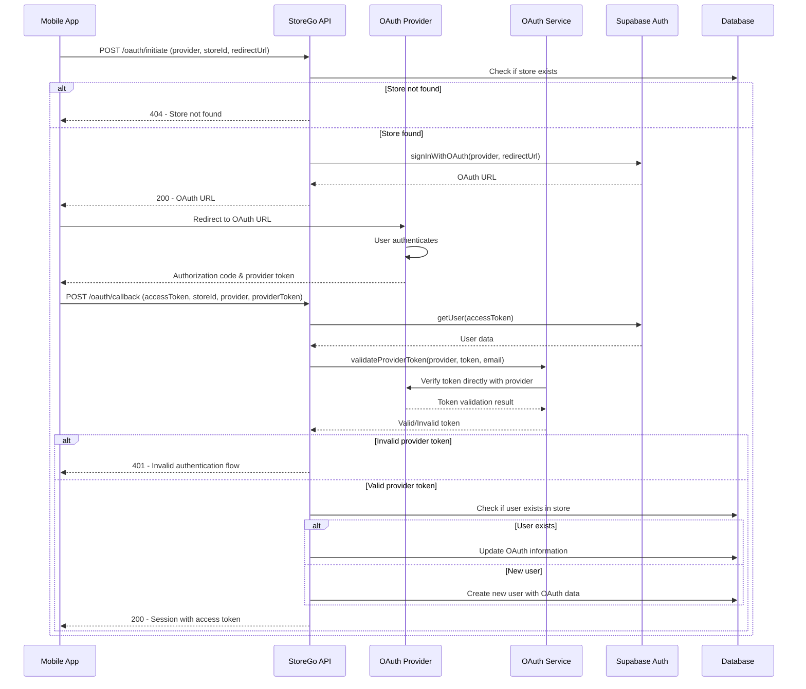

# StoreGo Authentication Workflow Diagram

This document provides sequence diagrams for the different authentication workflows in the StoreGo platform.

## User Registration (Sign Up) Workflow

## User Authentication (Sign In) Workflow

## Authenticated Request Workflow

## Token Refresh Workflow

## Password Reset Workflow

## Logout Workflow

## OAuth Authentication Workflow

These diagrams illustrate the complete authentication workflows in the StoreGo platform, from registration to authenticated API requests, providing a visual representation of the security mechanisms in place.
