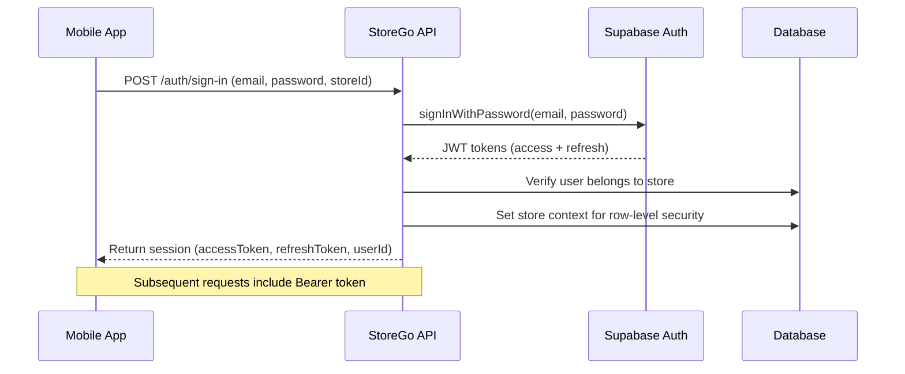
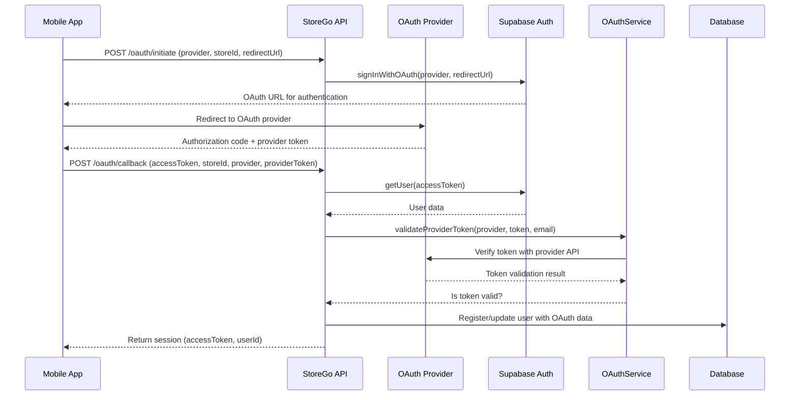
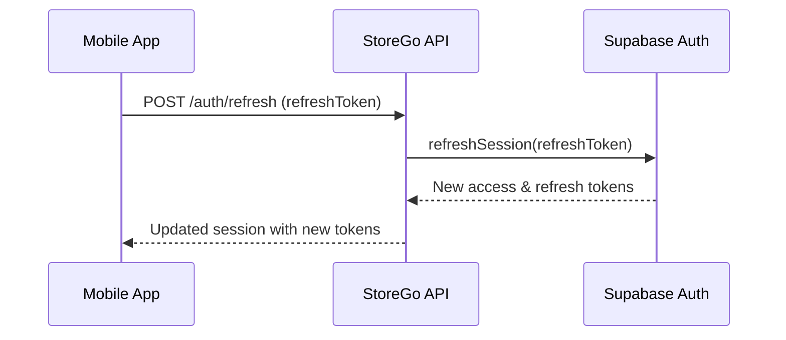

# StoreGo Authentication and Security Documentation

This document outlines the authentication workflow and security features implemented in the StoreGo platform and the generated mobile applications.

## Authentication Architecture

StoreGo implements a multi-layered authentication system that leverages Supabase for identity management and JWT-based authentication. The system is designed to securely handle both regular email/password authentication and OAuth provider authentication.

### Core Authentication Components

1. **Supabase Auth**: Backend authentication service for JWT management and user identity
2. **Hono API Routes**: Middleware-protected API endpoints
3. **OAuth Service**: Integration with third-party identity providers
4. **Token Validation Services**: Services to verify token authenticity and permissions
5. **Repository Layer Security**: Database access control based on authenticated context

## Authentication Workflows

### 1. Email/Password Authentication Flow



The email/password flow follows these steps:

1. User enters credentials and store ID in the mobile app
2. API validates the credentials with Supabase Auth
3. Once authenticated, the system verifies the user belongs to the correct store
4. Database context is set for row-level security
5. Session tokens are returned to the app for future requests
6. All subsequent requests must include the Bearer token in the Authorization header

### 2. OAuth Authentication Flow



The OAuth authentication flow provides additional security:

1. App initiates OAuth flow with provider selection and store ID
2. User authenticates with the third-party provider (Google, etc.)
3. Provider returns authorization code and tokens to the app
4. App sends these tokens to the StoreGo API
5. **Critical security step**: The OAuth service directly validates the provider token with the provider's API
6. If validation succeeds, the user is registered or logged in
7. Session details are returned for future authenticated requests

## Token Validation and Security

### Provider Token Validation

One key security feature is the validation of OAuth provider tokens. The system doesn't just trust tokens received from the app - it verifies them with the provider:

```typescript
static async validateGoogleToken(token: string, email: string) {
  try {
    // Google's token info endpoint
    const userInfoResponse = await fetch(
      "https://www.googleapis.com/oauth2/v3/userinfo",
      {
        headers: {
          Authorization: `Bearer ${token}`,
        },
      },
    );

    if (!userInfoResponse.ok) {
      return false;
    }

    const data = await userInfoResponse.json();

    // Verify the email matches and is verified
    return data.email === email && data.email_verified === true;
  } catch (error) {
    return false;
  }
}
```

This prevents token forgery and ensures that only legitimately authenticated users can access the system.

### Authentication Middleware

All protected API endpoints are secured using the `isAuthenticated` middleware:

```typescript
export async function isAuthenticated(c: Context, next: Next) {
  // Extract and validate Bearer token
  // Verify token with Supabase
  // Extract storeId from user metadata
  // Set database context for row-level security
  // Add user data to request context
  await next();
}
```

This middleware:

1. Ensures every request has a valid authorization header with Bearer token
2. Verifies the token with Supabase Auth
3. Extracts the store ID from user metadata
4. Sets the database context for row-level security (RLS)
5. Adds user data to the request context for authorization in route handlers

## Security Measures

### 1. Password Security

- Passwords are hashed using bcrypt before storage
- Password requirements include minimum length validation
- OAuth users don't have passwords stored in the system

### 2. Row-Level Security

The system implements database row-level security to ensure users can only access data related to their store:

```typescript
// Set the database context for row-level security
await supabaseAdmin.rpc("set_store_context", { store_id: storeId });
```

### 3. Token Management

- Access tokens have a short lifetime
- Refresh token rotation for long-term sessions
- Secure token storage recommendations for mobile apps

### 4. Multi-tenant Isolation

- User-to-store validation on every authentication
- Store ID embedded in JWT claims
- Database queries filtered by store ID

## Session Management

### Token Refresh Flow



When the access token expires, the application can use the refresh token to obtain a new pair of tokens without requiring the user to log in again.

### Logout Process

The system provides both client-side and server-side logout capabilities:

1. Server-side session invalidation
2. Client-side token removal
3. Optional user session deletion for complete security

## Best Practices for Generated Apps

Generated mobile applications should follow these security best practices:

1. Store tokens in secure storage (Keychain/KeyStore)
2. Implement certificate pinning for API communications
3. Refresh tokens when necessary using the refresh token flow
4. Clear tokens on logout
5. Implement biometric authentication when available

## OAuth Provider Support

The system currently supports the following OAuth providers:

- Google
- Facebook
- Twitter
- Apple
- GitHub

Additional providers can be added by extending the OAuth validation service with provider-specific token validation logic.

## Security Considerations

1. **Token Storage**: Access and refresh tokens should be stored securely in the mobile app
2. **HTTPS**: All API communications must use HTTPS
3. **Token Expiration**: Access tokens should have appropriate expiration times
4. **Error Handling**: Authentication errors should reveal minimal information
5. **Rate Limiting**: Implement rate limiting for authentication endpoints to prevent brute force attacks

By following these security measures and authentication workflows, the StoreGo platform ensures that generated applications maintain high security standards while providing a seamless user experience.
